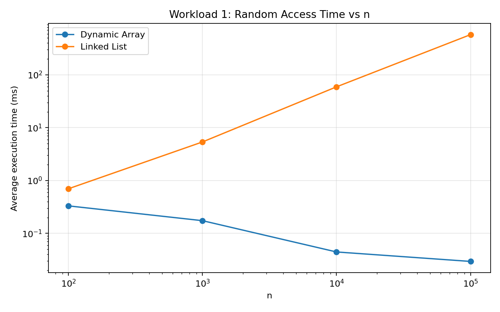
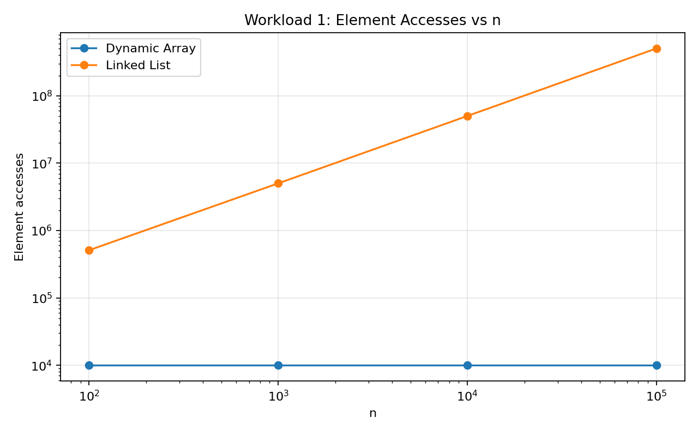
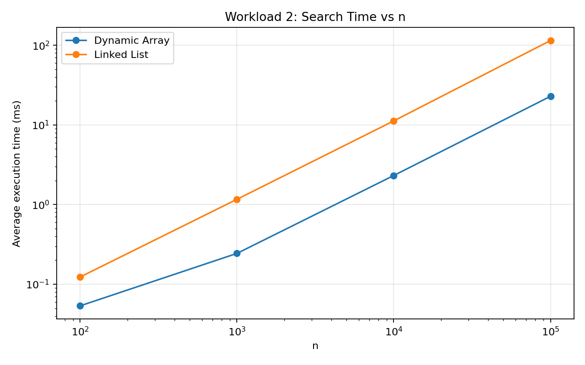
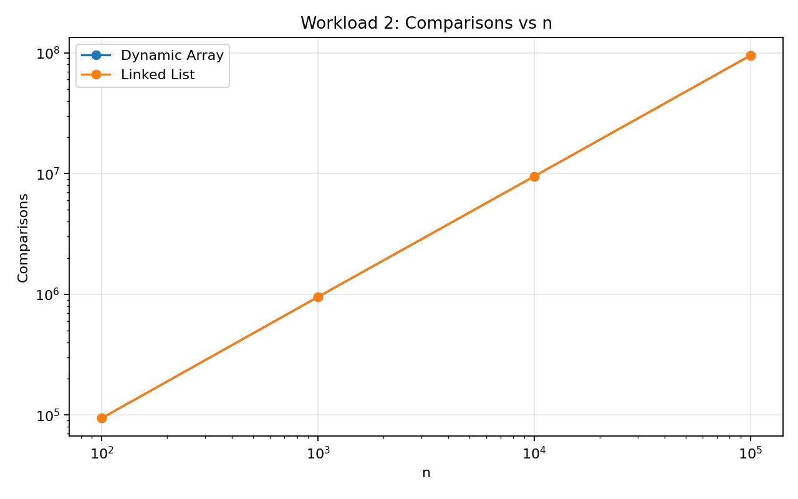
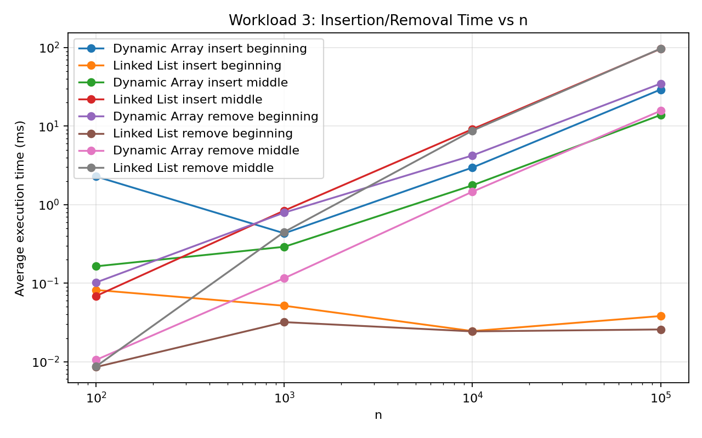
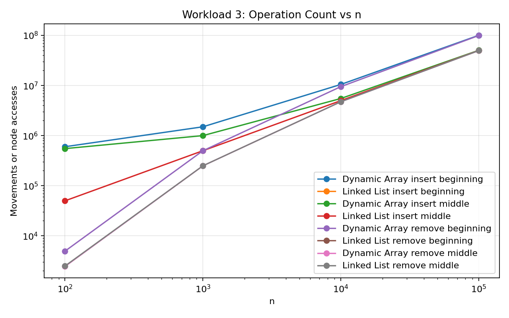
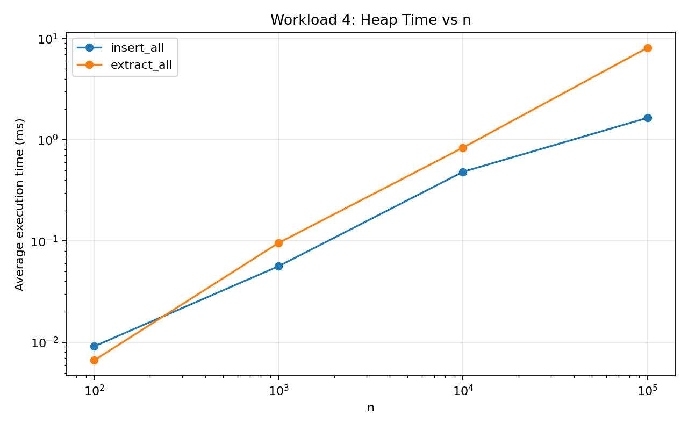
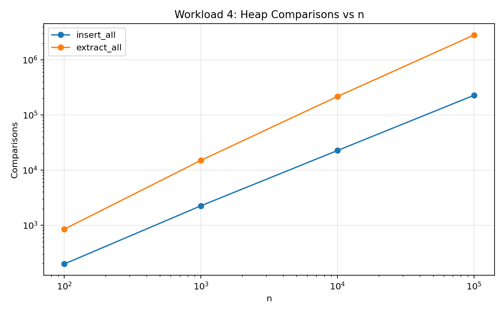

# Assignment 2 — Algorithmic Analysis, Correctness and Performance Trade-offs

## 1. Overview

This project implements three data structures in Java without using Java collections as the implementation:

- Dynamic Array
- Singly Linked List
- Min-Heap

The purpose of the assignment is to compare theoretical complexity with measured performance. The project also includes correctness tests, two loop-invariant proofs, four benchmark workloads, CSV result tables, and plots.

The Java standard collections are used only in `Tests.java` to validate the results.

## 2. Complexity Analysis

### Dynamic Array

| Operation   | Best Case | Average Case | Worst Case | Auxiliary Space | Explanation |
|-------------|---|---|---|---|---|
| add(x)      | Ω(1) | Θ(1) amortized | O(n) | O(n) during resize | Normally the value is added at the end. A resize copies all elements. |
| add(index, x) | Ω(1) | Θ(n) | O(n) | O(n) during resize | Elements after the index must be shifted right. |
| remove(index) | Ω(1) | Θ(n) | O(n) | O(1) | Removing the last element is constant, but other removals shift elements left. |
| get(index)  | Ω(1) | Θ(1) | O(1) | O(1) | Array elements are accessed directly by index. |
| contains(x) | Ω(1) | Θ(n) | O(n) | O(1) | Linear search is used. | 

### Linked List

| Operation | Best Case | Average Case | Worst Case | Auxiliary Space | Explanation |
|---|---|---|---|---|---|
| add(x) | Ω(1) | Θ(1) | O(1) | O(1) | A tail pointer is stored, so adding at the end is constant time. |
| add(index, x) | Ω(1) | Θ(n) | O(n) | O(1) | Beginning/end can be constant, but a middle position needs traversal. |
| remove(index) | Ω(1) | Θ(n) | O(n) | O(1) | Removing the first node is constant, but a middle/end position needs traversal. |
| get(index) | Ω(1) | Θ(n) | O(n) | O(1) | Nodes must be followed from the head. |
| contains(x) | Ω(1) | Θ(n) | O(n) | O(1) | Nodes are checked one by one. |

### Min-Heap

| Operation | Best Case | Average Case | Worst Case | Auxiliary Space | Explanation |
|---|---|---|---|---|---|
| insert(x) | Ω(1) | Θ(log n) | O(log n) | O(1) | The new value may move upward through the heap. |
| peekMin() | Ω(1) | Θ(1) | O(1) | O(1) | The minimum value is stored at index 0. |
| extractMin() | Ω(1) | Θ(log n) | O(log n) | O(1) | The root is replaced by the last value and may move downward. |

Two operations can have the same Big-O complexity but different real execution times. Big-O ignores constants, memory layout, cache behavior, object allocation, and implementation details. For example, both `contains` methods are Θ(n), but the Dynamic Array is usually faster because its values are stored next to each other in memory, while the Linked List follows node references.

## 3. Correctness

### Loop Invariant 1 — Dynamic Array add(index, x)

The important loop is:

```java
for (int i = size; i > index; i--) {
    data[i] = data[i - 1];
}
```

**Invariant:** At the start of every loop iteration, all elements to the right of position `i` have already been moved one position to the right and still keep their original order. Elements before `i` have not been changed yet.

**Initialization:** Before the first iteration, `i = size`. No element has been shifted yet, so the shifted part is empty. The invariant is true.

**Maintenance:** During one iteration, `data[i - 1]` is copied to `data[i]`. This moves exactly one more original element one position to the right. The already shifted elements stay correct, so the invariant remains true.

**Termination:** The loop stops when `i == index`. At this moment, every original element from `index` to `size - 1` has been moved one position to the right. Therefore position `index` is free.

After the loop, the method stores `x` in `data[index]`. The old elements are still in the same order and the new element is at the required position. Therefore the insertion is correct.

### Loop Invariant 2 — Min-Heap extractMin()

After the minimum value is saved, the last heap element is moved to index 0. The method then repeatedly compares the current value with its children and swaps it with the smaller child when needed.

**Invariant:** At the start of each iteration, the heap property is correct everywhere except possibly between the current node and its children. Any possible heap violation is located at the current index.

**Initialization:** Before the loop starts, the last value has replaced the root. All other parent-child relationships are unchanged, so only the root can violate the heap property. The invariant is true.

**Maintenance:** The algorithm chooses the smallest child. If that child is smaller than the current value, the two values are swapped. The old position now contains the smaller value and satisfies the heap property. The only possible violation moves down to the child's old position. Therefore the invariant is maintained.

**Termination:** The loop stops when the current value has no child smaller than itself, or it has no children. Then the current position also satisfies the heap property. Because all other positions were already correct, the whole heap is valid.

The value returned by the method was the old root, which was the minimum element. Therefore `extractMin()` returns the correct value and leaves a valid Min-Heap.

## 4. Experimental Setup

The benchmark uses these input sizes:

```text
n = 100, 1,000, 10,000, 100,000
```

The workloads use:

- Workload 1: `m = 10,000` random `get(index)` operations.
- Workload 2: `m = 1,000` `contains(value)` operations.
- Workload 3: `m = 1,000` insertions or removals.
- Workload 4: `n` insertions and `n` extractions.

Benchmark rules used in the implementation:

- every experiment is executed 5 times;
- the reported time is the average of the 5 runs;
- timing uses `System.nanoTime()`;
- random generation starts from `new Random(42)`;
- input data and random indices/values are generated before the timed section;
- printing and input generation are not part of the timed section;
- a small JVM warm-up is performed before the measured workloads;
- comparisons, element accesses, or movements are counted depending on the workload.

### Specification Note for Workload 3

The assignment requires 1,000 removals for every `n`, including `n = 100`, and also requires middle removals at `index = n / 2`. A structure that starts with only 100 elements cannot perform 1,000 removals. To keep exactly 1,000 removal operations without an invalid-index error, the removal benchmark creates `n + 1,000` input elements. The reported `n` and the required middle index `n / 2` are unchanged. This adjustment is only used for the removal part of Workload 3.

## 5. Results

The values below were produced by running `Benchmark.java`. Times can be different on another computer, but the growth trends should be similar.

### Workload 1 — Random Access

| n | Structure | Average Time (ms) | Element Accesses | Theory |
|---:|---|---:|---:|---|
| 100 | Dynamic Array | 0.331587 | 10,000 | Θ(1) per get |
| 100 | Linked List | 0.699926 | 511,327 | Θ(n) per get |
| 1,000 | Dynamic Array | 0.174036 | 10,000 | Θ(1) per get |
| 1,000 | Linked List | 5.381037 | 5,021,262 | Θ(n) per get |
| 10,000 | Dynamic Array | 0.044538 | 10,000 | Θ(1) per get |
| 10,000 | Linked List | 59.353122 | 50,180,278 | Θ(n) per get |
| 100,000 | Dynamic Array | 0.029484 | 10,000 | Θ(1) per get |
| 100,000 | Linked List | 576.971136 | 504,940,938 | Θ(n) per get |





**Analysis:** Dynamic Array always performs exactly 10,000 direct element accesses because each `get` is constant time. The Linked List must traverse nodes from the head, so the number of accesses increases strongly with `n`. At `n = 100,000`, the Linked List performed more than 504 million node accesses. This agrees with Θ(1) array access and Θ(n) linked-list access. Small Dynamic Array timing differences are measurement/JVM effects because the number of actual accesses remains constant.

### Workload 2 — Search

| n | Structure | Average Time (ms) | Comparisons | Theory |
|---:|---|---:|---:|---|
| 100 | Dynamic Array | 0.053619 | 94,384 | Θ(n) average/worst |
| 100 | Linked List | 0.123419 | 94,384 | Θ(n) average/worst |
| 1,000 | Dynamic Array | 0.243903 | 952,021 | Θ(n) average/worst |
| 1,000 | Linked List | 1.165122 | 952,021 | Θ(n) average/worst |
| 10,000 | Dynamic Array | 2.317057 | 9,485,303 | Θ(n) average/worst |
| 10,000 | Linked List | 11.230645 | 9,485,303 | Θ(n) average/worst |
| 100,000 | Dynamic Array | 22.871374 | 95,047,696 | Θ(n) average/worst |
| 100,000 | Linked List | 114.657863 | 95,047,696 | Θ(n) average/worst |





**Analysis:** Both implementations use linear search, so they make the same number of value comparisons with the same input. The comparison count grows roughly with `n`, which agrees with Θ(n). The Linked List is slower even with the same number of comparisons because it must follow node references. The Dynamic Array has better memory locality.

### Workload 3 — Insertion and Removal

| n | Structure | Operation | Position | Average Time (ms) | Metric | Metric Type |
|---:|---|---|---|---:|---:|---|
| 100 | Dynamic Array | insert | beginning | 1.384683 | 600,620 | movements |
| 100 | Linked List | insert | beginning | 0.089312 | 0 | node accesses |
| 100 | Dynamic Array | insert | middle | 1.291850 | 550,620 | movements |
| 100 | Linked List | insert | middle | 0.087169 | 50,000 | node accesses |
| 100 | Dynamic Array | remove | beginning | 1.906175 | 599,500 | movements |
| 100 | Linked List | remove | beginning | 0.073261 | 0 | node accesses |
| 100 | Dynamic Array | remove | middle | 0.217622 | 549,500 | movements |
| 100 | Linked List | remove | middle | 0.078807 | 50,000 | node accesses |
| 1,000 | Dynamic Array | insert | beginning | 0.410648 | 1,500,780 | movements |
| 1,000 | Linked List | insert | beginning | 0.033586 | 0 | node accesses |
| 1,000 | Dynamic Array | insert | middle | 0.267977 | 1,000,780 | movements |
| 1,000 | Linked List | insert | middle | 0.586364 | 500,000 | node accesses |
| 1,000 | Dynamic Array | remove | beginning | 0.374194 | 1,499,500 | movements |
| 1,000 | Linked List | remove | beginning | 0.034355 | 0 | node accesses |
| 1,000 | Dynamic Array | remove | middle | 0.254901 | 999,500 | movements |
| 1,000 | Linked List | remove | middle | 0.583834 | 500,000 | node accesses |
| 10,000 | Dynamic Array | insert | beginning | 2.598988 | 10,509,740 | movements |
| 10,000 | Linked List | insert | beginning | 0.032212 | 0 | node accesses |
| 10,000 | Dynamic Array | insert | middle | 1.375385 | 5,509,740 | movements |
| 10,000 | Linked List | insert | middle | 5.879604 | 5,000,000 | node accesses |
| 10,000 | Dynamic Array | remove | beginning | 2.544412 | 10,499,500 | movements |
| 10,000 | Linked List | remove | beginning | 0.028819 | 0 | node accesses |
| 10,000 | Dynamic Array | remove | middle | 1.258406 | 5,499,500 | movements |
| 10,000 | Linked List | remove | middle | 5.653163 | 5,000,000 | node accesses |
| 100,000 | Dynamic Array | insert | beginning | 24.317754 | 100,499,500 | movements |
| 100,000 | Linked List | insert | beginning | 0.026609 | 0 | node accesses |
| 100,000 | Dynamic Array | insert | middle | 12.213013 | 50,499,500 | movements |
| 100,000 | Linked List | insert | middle | 57.465290 | 50,000,000 | node accesses |
| 100,000 | Dynamic Array | remove | beginning | 24.091952 | 100,499,500 | movements |
| 100,000 | Linked List | remove | beginning | 0.025189 | 0 | node accesses |
| 100,000 | Dynamic Array | remove | middle | 12.131206 | 50,499,500 | movements |
| 100,000 | Linked List | remove | middle | 57.331400 | 50,000,000 | node accesses |





**Analysis:** A Linked List is very efficient at the beginning because it only changes the head reference. This is why there is no traversal for beginning insertion/removal. For middle operations, the Linked List must first walk to the required position, so the node-access count increases linearly with `n`. A Dynamic Array needs element shifting at the beginning and in the middle. Beginning operations move more elements than middle operations. These results match the physical organization of the structures.

### Workload 4 — Priority Processing

| n | Phase | Average Time (ms) | Comparisons | Theory |
|---:|---|---:|---:|---|
| 100 | insert all | 0.009134 | 197 | O(n log n) upper bound |
| 100 | extract all | 0.006642 | 845 | Θ(n log n) total |
| 1,000 | insert all | 0.056454 | 2,241 | O(n log n) upper bound |
| 1,000 | extract all | 0.095932 | 14,978 | Θ(n log n) total |
| 10,000 | insert all | 0.482678 | 22,602 | O(n log n) upper bound |
| 10,000 | extract all | 0.837155 | 216,531 | Θ(n log n) total |
| 100,000 | insert all | 1.645790 | 227,662 | O(n log n) upper bound |
| 100,000 | extract all | 8.105470 | 2,831,463 | Θ(n log n) total |





**Analysis:** Heap insertion is O(log n) in the worst case, but a random inserted value often stops after only a small number of parent comparisons. Therefore the measured insertion comparison count is below the worst-case `n log n` bound. Extraction repeatedly performs heapify-down, and its comparison count grows close to `n log n`. `peekMin()` is Θ(1) because it only reads the root.

The benchmark also verifies that all extracted values are in non-decreasing order.

## 6. Discussion

### 1. How does increasing n affect each workload?

For Dynamic Array random access, increasing `n` does not increase the number of element accesses because `get(index)` is Θ(1). Linked List random access becomes much more expensive because every random access may require many node traversals.

Search becomes more expensive for both structures because both use a linear scan. Beginning insertion/removal is especially good for the Linked List, while middle operations become slower because traversal is required. Heap processing also becomes slower as `n` increases because the heap height grows logarithmically and there are more total operations.

### 2. Which experimental results agree with theoretical complexity?

The clearest matches are:

- Dynamic Array `get`: constant number of accesses.
- Linked List `get`: node accesses increase with `n`.
- `contains`: comparison count increases approximately linearly for both structures.
- Linked List insertion/removal at the beginning: constant traversal cost.
- Middle Linked List operations: traversal increases linearly.
- Dynamic Array beginning/middle operations: movements increase linearly.
- Heap extraction: comparisons increase close to `n log n`.

### 3. Where do experimental results differ from theoretical prediction?

Exact execution times do not increase perfectly according to a mathematical curve. Small inputs can be affected by JVM JIT compilation, timer precision, CPU scheduling, cache state, and other system activity. Big-O describes growth for large input sizes, not exact milliseconds.

Heap insertion also shows an important difference between a worst-case upper bound and typical random behavior. One insertion can require O(log n), but many random values stop after a few comparisons.

### 4. Why can two algorithms with the same Big-O complexity have different running times?

Big-O ignores constants and hardware behavior. Two Θ(n) algorithms can execute different instructions, use different memory layouts, and cause different numbers of cache misses. This is visible in the search workload: both structures perform the same number of comparisons, but the Dynamic Array is faster.

### 5. How do constant factors and implementation details affect performance?

A Dynamic Array stores primitive integers in one continuous array, which is cache-friendly. A Linked List creates separate Node objects and follows references. Heap operations use arithmetic on array indices and do not need node objects. These implementation details change the real execution time even when the asymptotic complexity is similar.

### 6. Why is a Dynamic Array preferable for some workloads?

A Dynamic Array is preferable when random access is frequent. `get(index)` is constant time. It is also good for sequential scans because values are stored contiguously in memory.

### 7. When can a Linked List be useful?

A Linked List can be useful when many insertions and removals happen at the beginning, or when a program already has a reference to the required node. In this implementation, beginning insertion and removal do not require shifting other elements.

### 8. Why is a Heap appropriate for priority-based processing?

A Min-Heap keeps the smallest element at the root. `peekMin()` is Θ(1), while insertion and extraction are O(log n). This makes it suitable for priority queues and tasks where the next minimum element must be processed repeatedly.

### 9. How does the workload influence the choice of data structure?

The best data structure depends on the operations used most often. Random-index access favors Dynamic Array. Frequent beginning insertion/removal favors Linked List. Repeated minimum-priority processing favors Min-Heap. There is no single structure that is best for every workload.

## 7. Design Recommendations

| Workload | Suitable Structure | Reason |
|---|---|---|
| Frequent random `get(index)` | Dynamic Array | Θ(1) direct access |
| Sequential search | Dynamic Array in this implementation | Same Θ(n) comparisons as list, but better memory locality |
| Insert/remove at beginning | Linked List | Θ(1) pointer update, no element shifting |
| Insert/remove in middle by numeric index | Depends on workload | Both are Θ(n); array shifts values, list traverses nodes |
| Repeated minimum-priority processing | Min-Heap | Θ(1) minimum lookup and O(log n) update operations |

## 8. Testing and Correctness Validation

`Tests.java` checks:

- empty structures;
- one element;
- multiple elements;
- duplicate values;
- first and last/boundary positions;
- invalid indices;
- large inputs with 100,000 values;
- Dynamic Array results against `java.util.ArrayList`;
- Linked List results against `java.util.LinkedList`;
- Min-Heap results against `java.util.PriorityQueue`;
- heap property after every tested insertion;
- heap property after every tested extraction;
- non-decreasing extraction order.

Current test result:

```text
All tests passed.
```

## 9. Conclusion

The experiment shows that theoretical complexity is useful for predicting how performance changes when input size grows. Dynamic Array is very strong for random access and sequential search. Linked List is strong for insertion and removal at the beginning but is slow for indexed access because nodes must be traversed. Min-Heap is suitable for priority processing because it keeps the minimum at the root and performs updates in logarithmic time.

The measurements generally agree with the theoretical analysis. Exact times are affected by constant factors, memory organization, the JVM, and hardware, so measured milliseconds do not always follow the theoretical curve perfectly.

## How to Compile and Run

From the project directory:

```bash
javac src/*.java
java -cp src Tests
java -cp src Benchmark
```

To recreate the plots, Python and Matplotlib are required:

```bash
python3 make_plots.py
```

The benchmark CSV files are saved in `results/tables/`. The plots are saved in `results/plots/`.
